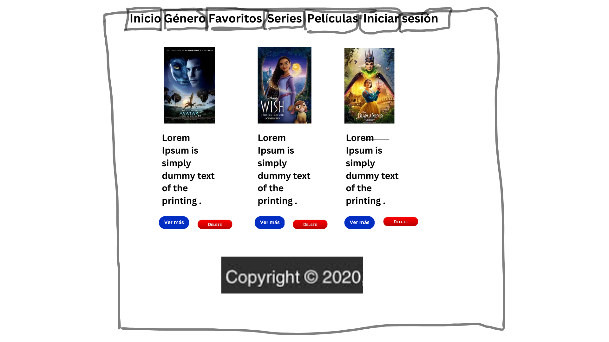
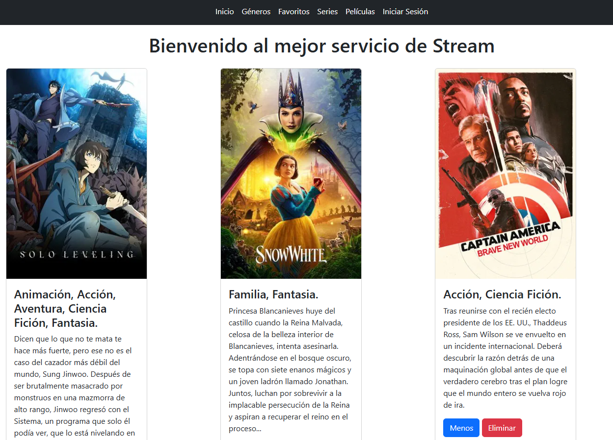
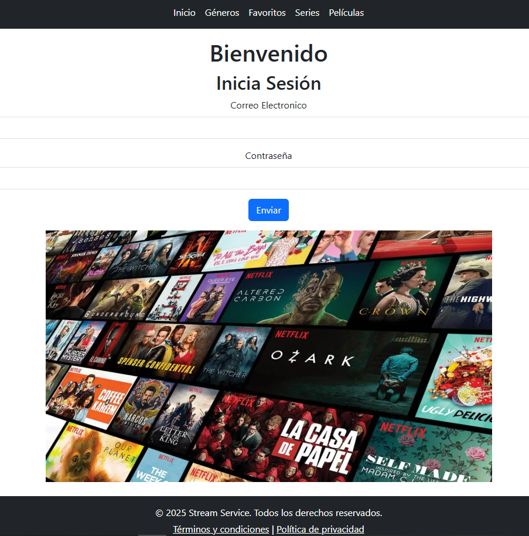

# YourStream

**Desarrollado por:** Jalil Samas Mendoza Reyes

## 1. Resumen
Esta página es una simulación de un servicio de streaming llamada YourStream.  
Cuenta con un diseño sencillo pero intuitivo para los usuarios.

## 2. Requerimientos técnicos
- Tecnologías utilizadas: HTML, JavaScript, Bootstrap, SCSS y Angular.

## 3. Cómo instalar
### Prerrequisitos:
- Git instalado
- Cuenta en GitHub
- Navegador web moderno (Chrome, Firefox, Edge, etc.)

### Pasos:

1. Clonar el repositorio:

git clone https://github.com/tu-usuario/nombre-repositorio.git

2. Abrir el proyecto:

  code .

3. Ejecutar la página:

Al ser un proyecto en angular, deberas usar ng s, para iniciar la pagina y poder verla en el ordenador.

## 4. Mockup de la aplicación

## 5. Capturas de pagina en funcionamiento

Esta es la página principal donde encontrarás todas las películas disponibles. 
Puedes expandir o contraer las sinopsis según tu preferencia, además de contar con un botón para eliminar cada tarjeta. 
Este diseño uniforme se mantiene en todas las secciones, excepto en la página de inicio de sesión.

Esta es la única página con un diseño diferente, donde podrás iniciar sesión en tu cuenta de usuario. 
Actualmente, esta función está en desarrollo, por lo que al intentar iniciar sesión serás redirigido automáticamente a la página de inicio.

## Proceso de creación 3
Moví gran parte de la lógica de los componentes a servicios especializados, mejorando:

- Separación de responsabilidades

- Reutilización de código

- Mantenibilidad

Implementé observables para manejar flujos de datos asíncronos, permitiendo:

- Mejor manejo de operaciones asíncronas

- Comunicación entre componentes

- Cancelación de suscripciones automática

Testing:

- Pruebas unitarias completas: Desarrollé tests para cada componente y servicio usando Jasmine/Karma

- Pruebas de integración: Verifiqué la interacción entre componentes

- Mocking de servicios: Para aislar pruebas de componentes

## 6. Sprint Review 2

| ¿Qué salió bien? | ¿Qué puedo hacer diferente? | ¿Qué no salió bien? |
|------------------|-----------------------------|---------------------|
| - Se llevaron a cabo las pruebas con éxito, generando un alto porcentaje de code coverage.   - Se logro separar el codigo para mejorar su estructura y mantenimiento.   -  La pagina de generos ahora es funcional.   | - El footer puede mejorar, evitando la contracción que genera al no completar el espacio.   - Aumentar la uniformidad entre las paginas debido a los nuevos cambios.   | - Al realizar algunos tests que simulan que la pagina cargue, muestra el error del footer.   - Perdí la uniformidad de las paginas al implementar tantos cambios.   - Cuando borro cards, no lo hacen de la misma manera en todas las paginas.

