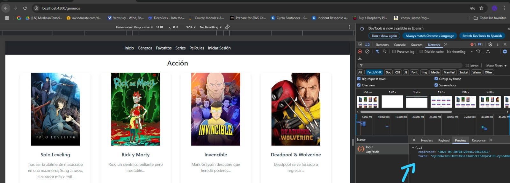
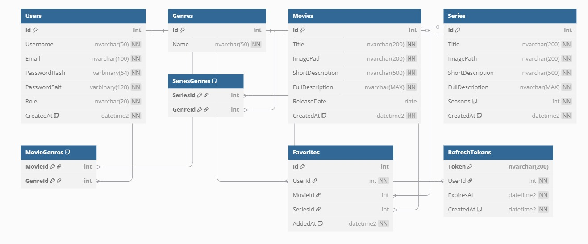
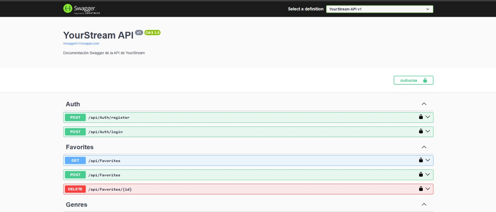

# YourStream

**Desarrollado por:** Jalil Samas Mendoza Reyes

## 1. Resumen
Esta página es una simulación de un servicio de streaming llamada YourStream.  
Cuenta con un diseño sencillo pero intuitivo para los usuarios.

## 2. Requerimientos técnicos
- Tecnologías utilizadas: HTML, JavaScript, Bootstrap, SCSS, Angular 18+, C#, SQL Server Management Studio 20, .Net 9, SDK 9, Thunder Client, Swagger.

## 3. Cómo instalar
### Prerrequisitos:
- Git instalado
- Cuenta en GitHub
- Navegador web moderno (Chrome, Firefox, Edge, etc.)

### Pasos:

1. Clonar el repositorio:

git clone https://github.com/tu-usuario/nombre-repositorio.git

2. Abrir el proyecto your-stream y YourStream.Api:

  Abres los dos con code .

3. Ejecutar la página:

Al ser un proyecto en angular, deberas usar ng s, para iniciar la pagina y poder verla en el ordenador.

Para el backend deberas usar dotnet run en una terminal de powershell y usar Thunder Client para usar el CRUD.

### Importante:

Deberas crear un usuario desde la base de datos y iniciar sesión para poder ver el contenido, de lo contrario solo tendras acceso al inicio y al login.

O si lo prefieres, puedes usar este usuario de prueba.

Usuario: usuario1
Contraseña: P@ssw0rd!

## 4. Mockup de la aplicación

## 5. Capturas de pagina en funcionamiento

Esta es la única página con un diseño diferente, donde podrás iniciar sesión en tu cuenta de usuario. 
Actualmente, esta función está en desarrollo, por lo que al intentar iniciar sesión serás redirigido automáticamente a la página de inicio.

## Tests

## Prueba de login

## Diagrama de base de datos

Puedes encontrar el script en los archivos

## Documentación en Swagger

## Posibles mejores futuras

- Botón de logout.

- Formulario.

- Icono que muestre inicio de sesión.

## Proceso de creación 5

Para este proceso de creación ya se habian adelantado varios puntos en el sprint pasado. 

1. API en ASP.NET Core – MVC

Cumplido,	Controladores en Controllers/, AddControllers() y MapControllers(). EF Core y JWT ya configurados.

2. Conexión con el proyecto Angular Cumplido

Cumplido, CORS tiene permitido para http://localhost:4200. Angular ya posee servicios e interceptor preparados.
   
3. Implementación de login con backend

Cumplido, Configuración JWT en Program.cs + existencia de AuthController y auth.service.ts en Angular.

4. Manejo de CORS implementado
Cumplido,	Se registra política WithOrigins("http://localhost:4200"), luego se aplica con app.UseCors().

En este sprint se hicieron ajustes a estos puntos y se agrego documentación con Swagger y se aseguro poblar la DB.

## 6. Sprint Review 5

| ¿Qué salió bien? | ¿Qué puedo hacer diferente? | ¿Qué no salió bien? |
|------------------|-----------------------------|---------------------|
| -Se cambio correctamente las rutas protegidas para liberar get y poder recibir la información sin un token y solo las importantes siguen con verificación   - Se corregio un error en el backend debido a la falta de DTOs.   -  Se paso la información a la base de datos.   | - Estoy con la duda del cambio de la estructura para el consumo total de la API, la creación de mi proyecto en angular se hizo con un enfoque a consumo local. Tengo todo listo en el backend asi que me gustaria saber si es obligatorio el consumo del 100% de la API.   | - Me confie en que habia avanzado suficiente en el sprint pasado y tuve menos tiempo para corregir errores y implementar mejoras.

