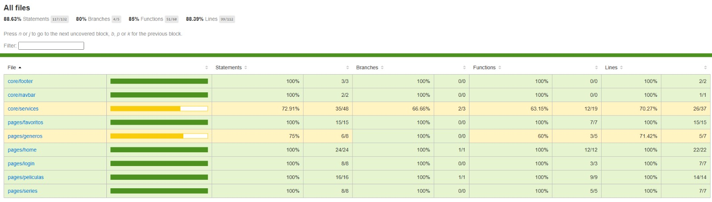

# YourStream

**Desarrollado por:** Jalil Samas Mendoza Reyes

## 1. Resumen
Esta página es una simulación de un servicio de streaming llamada YourStream.  
Cuenta con un diseño sencillo pero intuitivo para los usuarios.

## 2. Requerimientos técnicos
- Tecnologías utilizadas: HTML, JavaScript, Bootstrap, SCSS, Angular, C#, SQL Server Management Studio 20, .Net 9, SDK 9.

## 3. Cómo instalar
### Prerrequisitos:
- Git instalado
- Cuenta en GitHub
- Navegador web moderno (Chrome, Firefox, Edge, etc.)

### Pasos:

1. Clonar el repositorio:

git clone https://github.com/tu-usuario/nombre-repositorio.git

2. Abrir el proyecto:

  code .

3. Ejecutar la página:

Al ser un proyecto en angular, deberas usar ng s, para iniciar la pagina y poder verla en el ordenador.

## 4. Mockup de la aplicación

## 5. Capturas de pagina en funcionamiento

Esta es la única página con un diseño diferente, donde podrás iniciar sesión en tu cuenta de usuario. 
Actualmente, esta función está en desarrollo, por lo que al intentar iniciar sesión serás redirigido automáticamente a la página de inicio.

## Tests

## Proceso de creación 3
1. Implementación de T-SQL y Estructura de Base de Datos

- Se diseñó y creó un esquema de base de datos en SQL Server Management Studio (SSMS) con tablas para géneros, películas, etc.

- Las tablas fueron mapeadas correctamente a entidades en Entity Framework Core mediante el ApplicationDbContext.

Se generó una migración inicial (baseline) que establece la estructura completa de la base de datos.

2. Sistema de Autenticación Seguro
   
- Se implementaron endpoints RESTful para registro y login (/api/auth/register y /api/auth/login).

- La autenticación utiliza JSON Web Tokens (JWT) para seguridad, generando tokens con tiempo de expiración.

Todos los endpoints protegidos fueron decorados con el atributo [Authorize] para garantizar acceso solo a usuarios autenticados.

3. Consumo de Datos desde Frontend

- Se desarrollaron controladores CRUD completos para gestionar géneros, películas, series y favoritos (aún falta decidir si consumir local o de la API, pero estan listos).

- El frontend Angular consume estos endpoints mediante servicios HTTP.

- Se implementó un interceptor Angular que añade automáticamente el token JWT a las cabeceras de las peticiones.

4. Funcionalidad de Login Completa
   
- El sistema de login es completamente funcional, almacenando el token JWT en el almacenamiento local del navegador.

- El token se utiliza para mantener la sesión del usuario y para autorizar peticiones subsiguientes.

5. Arquitectura Frontend Moderna
   
- La aplicación Angular fue configurada usando el enfoque standalone (sin AppModule tradicional).

- Se utilizó Bootstrap para el diseño responsive, integrado directamente en los componentes standalone.

- Las rutas están protegidas con un AuthGuard que redirige a los usuarios no autenticados al login.

## 6. Sprint Review 3

| ¿Qué salió bien? | ¿Qué puedo hacer diferente? | ¿Qué no salió bien? |
|------------------|-----------------------------|---------------------|
| - Se llevaron a cabo las pruebas con éxito, generando un alto porcentaje de code coverage.   - Se logro separar el codigo para mejorar su estructura y mantenimiento.   -  La pagina de generos ahora es funcional.   | - El footer puede mejorar, evitando la contracción que genera al no completar el espacio.   - Aumentar la uniformidad entre las paginas debido a los nuevos cambios.   | - Al realizar algunos tests que simulan que la pagina cargue, muestra el error del footer.   - Perdí la uniformidad de las paginas al implementar tantos cambios.   - Cuando borro cards, no lo hacen de la misma manera en todas las paginas.

